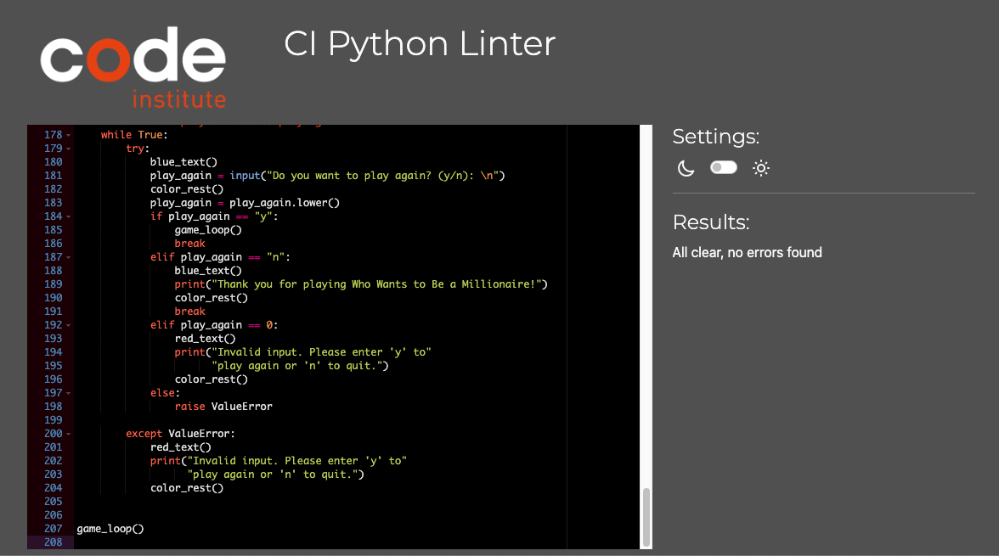
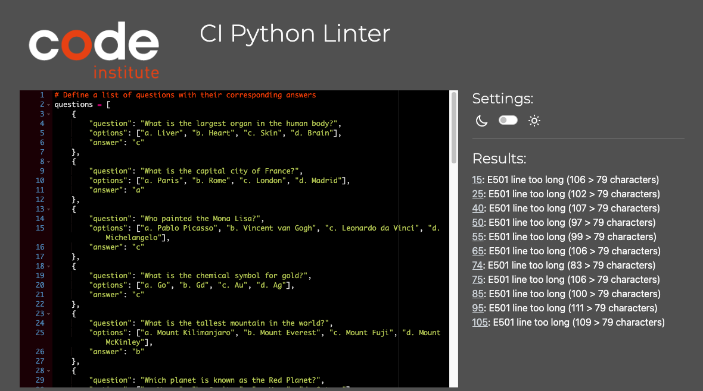

# Who Wants to Be a Millionaire Game

This is a Python program that simulates the game "Who Wants to Be a Millionaire." It presents a series of multiple-choice questions to the player and allows them to answer in order to win money. The game ends if the player answers a question incorrectly or if they reach the $1,000,000 question and answer it correctly.

[Play the game here](https://be-a-millionaire.herokuapp.com/)
* note: In this document, to open any links in a new browser tab, please press CTRL + Click.*

  

## Table of Contents
* [User Experience Design (UX)](#UX)
    * [Strategy](#strategy)
      * [User Stories](#User-Stories)
    * [Scope](#scope)
    * [Structure](#structure)
      * [App Logic](#application-logic)
    * [Skeleton and Surface](#skeleton-and-surface)
      * [Text Layouts](#text-layouts)        
      * [Chromatics](#chromatics)
* [Features](#features)
* [Testing](#testing)
* [Deployment](#deployment)
* [Credits](#credits)

## UX
### Strategy:
   * The code implements the game "Who Wants to Be a Millionaire" and focuses on engaging the player by presenting multiple-choice questions and offering the opportunity to win money.
   * The strategy includes defining the game rules, presenting questions in an intuitive manner, and providing feedback on the player's answers.

#### User Stories:
   * The code aims to cater to the user's needs and desires by providing an interactive and enjoyable game experience.
   * User stories may include scenarios like "As a player, I want to be able to enter my name to personalize the game" or "As a player, I want to receive feedback on whether my answer is correct or incorrect."

### Scope:
   * The scope of the code is to simulate the "Who Wants to Be a Millionaire" game, allowing users to play, answer questions, accumulate winnings, and potentially become a millionaire.
   * The code's scope may involve defining the number of questions, the money increment pattern, and the end condition.

# Structure:
   * The code follows a structured approach to ensure the flow of the game. It includes functions for getting the player's name, displaying game rules, asking questions, checking answers, and handling game progression.
   * The code organizes these functions within the `game_loop` function, which serves as the main structure of the game.

#### App Logic:
   * The code's logic revolves around presenting questions, validating user input, checking answers, updating the player's winnings, and determining game outcomes.
   * It ensures that the game follows the logic of the "Who Wants to Be a Millionaire" TV show, where players progress through questions, earn money for correct answers, and face potential game-ending scenarios.
   * The app's logic flow was designed using Adobe Illustrator!
   * [Logic Flow Chart](docs/flowchart.jpg)

### Skeleton and Surface:
   * The code provides the basic structure (skeleton) for the game, including functions and logical flow.
   * The code's surface represents the user interface, which includes displaying the game title, prompts for user input, the rules, presenting questions, and showing feedback messages.

# Text Layouts:
   * The code utilizes text layouts to present information clearly and legibly to the player.
   * It includes the presentation of the game title, player name, questions, answer options, feedback messages, and total winnings.

#### Chromatics:
   * While the code doesn't explicitly involve visual design elements, chromatics can be applied to enhance the user experience through the selection of appropriate colors, fonts, and text formatting.
   * The code can benefit from using color or font variations to distinguish different sections of the game or to emphasize important messages.

By considering these UX concepts, the code can provide a more engaging and user-friendly experience for players interacting with the "Who Wants to Be a Millionaire" game.

## Features

* Multiple-choice questions: The game presents a series of questions to the player, each with four options (labeled as a, b, c, d).
* User input: The player can enter their answer by selecting the corresponding letter (a, b, c, d).
* Correct answer validation: The program checks if the user's answer is correct and provides appropriate feedback.
* Money winnings: The player wins a specific amount of money for each correct answer. The amount increases progressively for each question.
* Game over: If the player answers a question incorrectly, the game ends, and their total winnings are displayed.
* Play again option: After the game ends, the player is asked if they want to play again. If they choose to do so, the game restarts.

## Usage

1. Run the Python program using a Python interpreter.
2. The program will display the welcome message and ask for the player's name.
3. Enter the player's name (alphabets and up to 10 characters) and press Enter.
4. The program will display the game rules.
5. Press Enter to start the game.
6. The program will present a series of questions and ask the player to choose the correct answer by entering the corresponding letter (a, b, c, d).
7. After each question, the program will indicate if the answer is correct and display the amount of money won.
8. If the player answers a question incorrectly, the game ends, and their total winnings are displayed.
9. If the player answers the $1,000,000 question correctly, they become a millionaire, and the game ends.
10. After the game ends, the player is asked if they want to play again. Enter "y" to play again or any other key to exit the game.

## Customization

* Questions: The questions for the game are imported from a separate module named `questions.py`. You can modify the questions and options in that module to customize the game content.
* Money increments: The amount of money won for each question is defined in the `money_increments` list. You can modify the values in this list to change the progression of winnings.

**Note:** This program assumes that the `questions.py` module is present and contains a list of questions in the specified format. I Ensured that the `questions.py` module is available and part of the code and correctly formatted for the game to function properly and added 23 questions in this file, and in the future always avalible to add more question to make the game more chalnegable .  

# Testing
The project has been tested at every step of the project development, but I also asked friends and family to do detailed testing when the build was near completion. The few issues and inconveniences that were found during this testing phase have all been solved.

Upon project completion I have personally done extensive testing on every feature, as documented below. You can find the test details in the next table.

Certainly! Here's an example table that outlines different testing scenarios and their expected outcomes for the "Who Wants to Be a Millionaire" game:

| Test Case                                                  | Description                                                                                                                                                                            | Expected Outcome                                                      |
|------------------------------------------------------------|----------------------------------------------------------------------------------------------------------------------------------------------------------------------------------------|-----------------------------------------------------------------------|
| Test `get_player_name()` function with a valid name         | Enter a valid name (e.g., "John") in the `get_player_name()` function                                                                                                                   | The function should return the capitalized name "John"                |
| Test `get_player_name()` function with an invalid name      | Enter an invalid name (e.g., an empty string) in the `get_player_name()` function                                                                                                      | The function should prompt for a valid name and return the capitalized name |
| Test `get_player_name()` function with an invalid name      | Enter numbers (e.g., an 1,2,3,4,55) in the `get_player_name()` function                                                                                                      | The function should prompt for a valid name and return Invalid input! Please enter a valid name(between 3 to 10 alphabetic characters). |
| Test `check_answer()` function with a correct answer        | Provide a correct answer (e.g., "a") to the `check_answer()` function                                                                                                                   | The function should return `True` indicating a correct answer           |
| Test `check_answer()` function with an incorrect answer     | Provide an incorrect answer (e.g., "c") to the `check_answer()` function                                                                                                               | The function should return `False` indicating an incorrect answer        |
| Test `get_user_answer()` function with a valid option       | Enter a valid answer option (e.g., "b") in the `get_user_answer()` function                                                                                                             | The function should return the lowercase answer option "b"               |
| Test `get_user_answer()` function with an invalid option    | Enter an invalid answer option (e.g., "x") in the `get_user_answer()` function                                                                                                          | The function should prompt for a valid option and return the lowercase answer option |
| Test asking a question with correct answer                  | Present a question with a known correct answer and provide the correct answer (e.g., "b")                                                                                             | The function should return `True` indicating a correct answer           |
| Test asking a question with incorrect answer                | Present a question with a known correct answer and provide an incorrect answer (e.g., "c")                                                                                           | The function should return `False` indicating an incorrect answer        |
| Test game progression and reaching the $1,000,000 question | Play through the game, answering all questions correctly until reaching the $1,000,000 question and providing the correct answer (e.g., "d")                                            | The game should end with a message indicating the player becomes a millionaire |
| Test play again feature                                    | Choose to play again after the game ends and provide the appropriate input (e.g., "y" to play again)                                                                                 | The game should restart from the beginning with a new set of questions    |

These test cases cover different aspects of the game, including input validation, answer checking, game progression, and the play again feature. By executing these test cases and comparing the actual outcomes with the expected outcomes, you can verify the correctness and reliability of the game implementation.

### Validator Testing
* Python Checker - The python code was evaluated using the [CI Python Linter](https://pep8ci.herokuapp.com/) without any issues for run.py.
* for questions.py, "E501 line too long" error is ignored to maintain ease of future modification."

  
Results for run.py

  

  
Results for questions.py

  

  

## Deployment

The project was deployed using Heroku. The steps to deploy are as follows:

#### **Heroku Deployment** - Project Creation and Settings 
1. Sign up or Log in to [Heroku](https://heroku.com/)
2. Once in your dashboard, select "New" and then "Create New App"
3. Give your project a name (must be unique), select your region and confirm "create app" 

You'll now be taken to the Heroku Deployment Tab. In order to use the Code Institute mock terminal template for your deployed project, you'll need to do the following:

4. Navigate to the "Settings" tab
5. Click "Reveal Config Vars" to add a configuration variable with Key: **PORT** and Value: **8000**
6. Click "Add Buildpack" and add the packs **Python** and **NodeJS**
    * *Note that the order of added buildpacks have meaning. In this case, Python should be the first (top) and NodeJS second (bottom)*

#### **Heroku Deployment** - Deploying a Github Repository 
1. Navigate to the "Deployment" tab
2. Select "GitHub - Connect" under Deployment method and follow the steps necessary to connect your GitHub account
3. Select your GitHub account from the droplist, enter your repository name and click search
4. Choose "Connect" at the correct repository to connect the repo to your Heroku app
5. Further down on the Deployment page, you'll find "Automatic deploys" and "Manual deploy"
    * For automatic, choose the branch you wish to deploy and click "Enable Automatic Deploys".  This allows Heroku to automatically rebuild your app when your Github repository is updated
    * For manual, choose the branch you wish to deploy and click "Deploy Branch"
6. Once Heroku is finished with the build process you will be notified with a "Your App Was Successfully Deployed" message and a link to the app

## Credits

### Utilised Libraries
- **`colorama`**   It is helping me to make sure users read and interpret the text properly, easily and with enjoyment.
- **`os`**   was imported to help clear the terminal, this keeping the interface polished and distraction-free for the user. in the end of the project i add it after i read about it on [Stack Overflow](https://stackoverflow.com/questions/2084508/clear-terminal-in-python)

### Acknowledgements
* Big Thanks to Rory Patrick Sheridan for being an amazing mentor, as usual!

Enjoy playing "Who Wants to Be a Millionaire"!